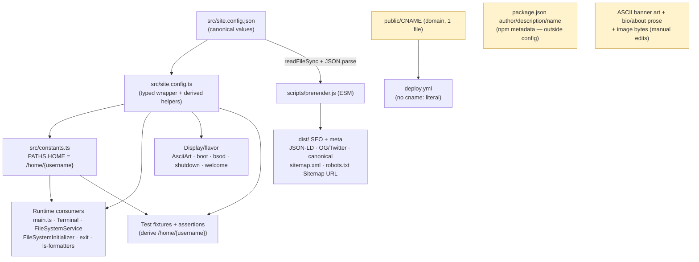

# feat: Config-driven single source of truth for site identity

## Summary

Introduce one canonical config file (`src/site.config.json`, exposed through a
typed `src/site.config.ts` wrapper) that owns every personalized identity value:
the structural terminal username, display name, domain/site URL, email, social
links, and default theme. Every consumer — the app bundle, the ESM build script,
and the deploy workflow — derives from that one file instead of repeating the
literal. After this, renaming the structural username `darin` is a true one-file
edit that keeps `pnpm validate` green; a domain change is two files (the config
plus `public/CNAME`, which GitHub reads directly); and a small fixed remainder —
npm metadata, the favicon/OG image bytes, the bespoke ASCII banner art, and
authored content — stays a documented manual edit (see Scope Boundaries).

---

## Problem Frame

PR #6 shipped `TEMPLATE.md`, a manual guide that lists every place the author's
identity is hardcoded — because a find-and-replace rename is brittle (`darin` is
a substring of `/home/darin` paths and appears ~480 times across ~63 files).
The guide works, but it pushes the work onto the forker and is easy to get wrong.

The hardest value is the terminal **username** `darin`. It is not just display
text — it drives the virtual filesystem home directory (`/home/darin`), the shell
prompt (`darin@…`), the `$USER`/`$HOME`/`$LOGNAME`/`$PWD` env vars, file-ownership
defaults, every derived path constant, and is asserted literally across ~30 test
files. That last fact is why a config alone isn't enough: if tests still hardcode
`darin`, renaming the config value turns `pnpm validate` red, defeating the
one-file-edit goal. Making the rename a true one-file edit therefore requires
de-hardcoding the test suite as well — that is the center of gravity of this work.

This plan is a follow-up to the deliberate PR #6 decision _not_ to ship a rename
script. Instead of automating a risky text substitution, it removes the
duplication at the source so there is only one value to change.

---

## Requirements

### Single source of truth

- R1. `src/site.config.json` is the canonical source for: terminal `username`,
  display `name`, `tagline`, `domain`, `siteUrl`, `email`, social links (GitHub,
  LinkedIn), and `defaultTheme`.
- R2. The app bundle consumes config through a typed `src/site.config.ts` wrapper
  that preserves strict typing (zero `any`, no loss of type-coverage gate).

### Runtime parity (the structural username)

- R3. The structural username drives `/home/<username>`, the prompt, the
  `$USER`/`$HOME`/`$LOGNAME`/`$PWD` env vars, file-ownership defaults, and all
  derived path constants — with no remaining hardcoded `darin` literal anywhere in
  `src/` except authored content under `src/content/`.
- R4. Display name, tagline, and domain flow from config to the page header and
  tagline, the prompt host, the boot/bsod/shutdown/exit flavor text, and the
  filesystem welcome/README text. (The bespoke ASCII banner art is identity that
  cannot be derived from `name` by substitution — it is a documented manual edit;
  see Scope Boundaries.)

### Build-time and deploy

- R5. Build-time SEO/meta produced by `scripts/prerender.js` (site URL, every
  per-page `<title>` suffix, JSON-LD `name`/`author`/`jobTitle`, `sameAs` social
  links, OG/Twitter tags including `og:image`/`twitter:image`, `meta[author]`,
  `meta[description]`, canonical URLs, sitemap, and the `robots.txt` `Sitemap:`
  URL) all derive from the same config — no duplicated domain or name string
  anywhere in the script (it currently repeats the display name ~18 times).
- R6. `.github/workflows/deploy.yml` carries no duplicated domain literal; the
  domain lives once in `public/CNAME`, which is already published with `dist/`.

### One-file guarantee

- R7. No test hardcodes the username or `/home/<username>` literal. Test fixtures,
  helpers, and assertions derive from config so that changing `username` (or
  `domain`) keeps `pnpm validate` green with no other edits.
- R8. A regression guard fails CI if a disallowed source file reintroduces the
  username literal, making the one-file guarantee durable rather than a snapshot.

### Documentation

- R9. `TEMPLATE.md` and related docs are rewritten around "edit one config file"
  with an explicit, short list of the values that remain outside config and why.

---

## Key Technical Decisions

- KTD1. **JSON source + typed TS wrapper** (single source format). `src/site.config.json`
  holds the values; `src/site.config.ts` imports it (`resolveJsonModule` is already
  enabled in `tsconfig.json`) and re-exports it with an explicit interface plus
  derived helpers. Rationale: the Vite app bundle imports the wrapper natively, and
  the ESM `scripts/prerender.js` reads the same JSON via `readFileSync` + `JSON.parse`
  — both consume one file with zero generate/transpile step and no drift surface. A
  `.ts`-authored source would force a generate step the user explicitly rejected.

- KTD2. **Rename `PATHS.HOME_DARIN` → `PATHS.HOME` and compute `PATHS` from
  `siteConfig.username`.** The rename makes the TypeScript compiler enumerate every
  consumer (no silent misses), and `HOME` is the honest name once it is no longer
  darin-specific. Trade-off: template-literal path values widen from literal types
  to `string`. Verify (via `pnpm type-check`) that no consumer relies on the literal
  type of a `PATHS.*` value. `HOME_GUEST` and the guest `.alias` path stay literal —
  the guest account is fixed infrastructure, not personalization.

- KTD3. **`EnvVarManager` needs no internal change.** It already accepts `username`
  and `hostname` and computes `/home/${username}`; only the `src/main.ts` call site
  changes to pass `siteConfig` values. Confirmed at `src/utils/EnvVarManager.ts:24-46`.

- KTD4. **`prerender.js` reads the JSON with `readFileSync` + `JSON.parse`** (not
  import attributes) for Node-version portability across local dev and the CI Node 22
  runner. It currently hardcodes the display name ~18 times (per-page `<title>`
  suffix on ~10 pages, blog-feed name, contact title, JSON-LD `jobTitle`/bio) — all
  must be templatized from config via the page-title builder and the schema fields.
  Add **new** `replaceOrThrow` rules (not extensions of existing per-page
  replacements) for `meta[name=author]`, `meta[description]`, and the absolute
  `og:image` **and** `twitter:image` URLs, so the source `index.html` no longer
  needs hand-editing; verify each new rule's marker against `index.html` so the
  build fails loudly on drift.

- KTD5. **Drop the `cname:` input from `deploy.yml`.** `public/CNAME` is copied into
  `dist/` by Vite, and `peaceiris/actions-gh-pages@v4` publishes an existing CNAME in
  `publish_dir` as-is. This removes the only duplicated domain literal in CI; the
  domain then lives once in `public/CNAME`.

- KTD6. **De-hardcode central test fixtures/helpers first, then leaf assertions.**
  `tests/helpers/mock-filesystem.ts` and `tests/fixtures/integration-data.ts` are
  imported by many tests; fixing them collapses most of the churn before touching
  individual assertions. The acceptance proof is a flip-the-config run (change
  `username`, run `pnpm validate`, expect green).

- KTD7. **Ship a regression guard test** that scans `src/` (allowlisting
  `src/site.config.*` and `src/content/`) for the configured username literal and
  fails if it reappears. Without this, the one-file guarantee silently rots the next
  time someone types the old literal.

- KTD8. **Config owns identity for code and meta, not authored content.** Email and
  social links live in config for SEO/JSON-LD consumption; `src/content/contact.md`
  stays hand-authored (it is content, already stubbed by `reset-content`). Config is
  deliberately _not_ injected into markdown — that would require a content-templating
  layer, which is out of scope and against the project's simplicity bar.

---

## High-Level Technical Design

One JSON file feeds three consumer tiers. The wrapper serves everything inside the
Vite bundle; the build script reads the raw JSON; only npm and DNS metadata remain
outside (they cannot import anything).

The amber boxes are the irreducible remainder: `public/CNAME` _is_ the domain (GitHub
reads it directly), `package.json` `author`/`description`/`name` are npm metadata, and the
bespoke banner art, bio/about prose, and image bytes can't be derived from a string. None
can import config; each is a single, obvious, rarely-changed manual edit.

---

## Implementation Units

### U1. Create the single source of truth

- Goal: Add `src/site.config.json` with all identity values and `src/site.config.ts`
  as the typed wrapper exposing the values plus derived helpers (e.g. `homeDir`).
- Requirements: R1, R2
- Dependencies: none
- Files:
  - `src/site.config.json` (new)
  - `src/site.config.ts` (new) — `interface SiteConfig`, imports the JSON, re-exports
    typed `siteConfig`, exports derived `homeDir = \`/home/${siteConfig.username}\``
  - `tests/unit/site.config.test.ts` (new)
- Approach: JSON holds `username`, `name`, `tagline`, `domain`, `siteUrl`, `email`,
  `social: { github, linkedin }`, `defaultTheme`. `social` values are full profile URLs
  (not bare handles), because `prerender.js`'s JSON-LD `sameAs` and `contact.md` both
  consume full URLs — storing handles would force URL assembly in two places. Wrapper
  applies the `SiteConfig` interface (explicit types, no `any`) so the rest of the app
  imports strongly-typed values. Keep the wrapper free of side effects so both Vite and
  tests import it cheaply.
- Patterns to follow: `src/constants.ts` (centralized `as const` config object),
  `src/config.ts` (existing small config module).
- Test scenarios:
  - Happy path: `siteConfig.username` / `name` / `tagline` / `domain` / `siteUrl` /
    `email` / `social.github` / `social.linkedin` / `defaultTheme` are all present and
    non-empty.
  - Derived value: `homeDir` equals `/home/${siteConfig.username}`.
  - Type/shape: the wrapper export satisfies `SiteConfig` (compile-time; assert key set
    at runtime so a JSON typo is caught).
- Verification: `pnpm type-check` passes; new test green.

### U2. Derive paths and wire structural runtime consumers

- Goal: Make `PATHS` and every runtime consumer of the username/home/hostname derive
  from `siteConfig`, removing all structural `darin` literals from `src/` (non-content).
- Requirements: R3
- Dependencies: U1
- Files:
  - `src/constants.ts` — rename `HOME_DARIN` → `HOME`; compute `HOME` and the
    `CONTENT_*` / `CONFIG_SETTINGS` / `CONFIG_ENV` paths from `siteConfig.username`
  - `src/main.ts` — pass `siteConfig.username` / `siteConfig.domain` to `EnvVarManager`
    (line ~87); replace the `/home/darin/CHANGELOG.md` literal (lines ~235-236) with a
    `PATHS.HOME`-derived path
  - `src/utils/fs/FileSystemService.ts` — `currentUsername` and the `owner` default
    (lines ~9, ~13, ~169) from `siteConfig.username`; initial path from `PATHS.HOME`
  - `src/utils/fs/FileSystemInitializer.ts` — the `darin` home directory it creates and
    the `owner` defaults in `createDirectoryNode`/`createFileNode` (lines ~11, ~25, ~233-234)
  - `src/components/Terminal.ts` — `username` / `hostname` members (lines ~29-30)
  - `src/commands/core/exit.ts` — the root-exit fallback that restores `darin` /
    `/home/darin` (lines ~54-60)
  - `src/utils/ls-formatters.ts` — owner fallback (line ~59)
  - `src/utils/PromptFormatter.ts` — example paths in comments (lines ~29, ~210)
  - `tests/unit/utils/fs/FileSystemService.test.ts`, `.../FileSystemInitializer.test.ts`,
    `tests/unit/utils/EnvVarManager.test.ts`, `tests/unit/components/Terminal.test.ts`,
    `tests/unit/utils/PromptFormatter.test.ts` — update for the renamed constant
    (full literal de-hardcoding happens in U6/U7; here, only keep them compiling/green
    against the rename)
- Approach: The `HOME_DARIN` → `HOME` rename is intentional — the compiler error list
  becomes the consumer checklist. `EnvVarManager` is unchanged (KTD3). Watch the
  literal-type widening called out in KTD2.
- Execution note: Characterization-first — run the existing FS/env/prompt tests before
  changing behavior so any path-resolution regression surfaces immediately.
- Patterns to follow: existing `PATHS` usage; `EnvVarManager` parameterization.
- Test scenarios:
  - Happy path: `FileSystemService` initializes `getCurrentPath()` to `/home/<username>`;
    `~` resolves to `/home/<username>`.
  - Env vars: `EnvVarManager` sets `HOME`/`PWD` to `/home/<username>` and
    `USER`/`LOGNAME` to `<username>` for a non-default username value.
  - Ownership: a newly created node's `owner` equals `siteConfig.username`.
  - Edge: changing directory to `/home` then `~` returns to the configured home.
  - Regression: all pre-existing FS/env/prompt assertions still pass after the rename.
- Verification: `pnpm type-check` and the FS/env/prompt suites pass.

### U3. Wire display name, tagline + domain into flavor/header/welcome text

- Goal: The page tagline, novelty flavor text, and filesystem welcome/README derive name,
  tagline, and domain from config. The bespoke ASCII banner art is explicitly NOT
  config-driven (see Scope Boundaries).
- Requirements: R4
- Dependencies: U1
- Files:
  - `src/utils/AsciiArt.ts` — `getTagline()` returns `siteConfig.tagline`;
    `generateHeader()` banner art stays hardcoded (documented manual edit, not wired)
  - `src/components/Header.ts` — already renders `AsciiArt.getTagline()`; no change needed
    if it keeps reading through the helper
  - `src/commands/novelty/boot.ts` — kernel/login/welcome lines that embed
    `darin`/`darinchambers.com` (e.g. `6.8.0-darin`, `login: darin`,
    `darin@darinchambers.com`, welcome text — lines ~26, 29, 52, 54, 64, 69)
  - `src/commands/novelty/bsod.ts`, `src/commands/novelty/shutdown.ts` — host/name in output
  - `src/commands/core/exit.ts` — logout message host (display strings; structural
    fallback already handled in U2)
  - `src/utils/fs/FileSystemInitializer.ts` — `Welcome to <domain>!`, the
    `cd /home/<username>` README hint, and the `- Darin` / easter-egg flavor strings
    (lines ~223, 228, 245) — convert the structural ones; any remaining easter-egg literal
    must either be converted or added to the U8 guard allowlist
  - `tests/unit/commands/novelty/boot.test.ts` and any flavor-text assertions touched
- Approach: Replace name/domain/tagline string literals with `siteConfig` values. The
  ASCII banner art in `generateHeader()` is deliberately left hardcoded — it is bespoke
  block-character art that cannot be reproduced from `name` by substitution, and figlet
  output would not match it; it is documented as a manual edit alongside binary assets.
- Patterns to follow: existing flavor-text command structure.
- Test scenarios:
  - Happy path: `boot` output contains `${siteConfig.username}@${siteConfig.domain}`.
  - Tagline: the header renders `siteConfig.tagline`, not a literal.
  - Display: `shutdown`/`bsod` output references the configured domain, not a literal.
  - Welcome: filesystem README/welcome text references the configured domain and home path.
  - Test expectation: none for the banner art — intentionally manual / not config-driven.
- Verification: novelty + filesystem-init suites pass.

### U4. Build-time meta: prerender consumes the config JSON

- Goal: `scripts/prerender.js` derives all identity-bearing output from the config JSON;
  the source `index.html` needs no hand-edited identity values.
- Requirements: R5
- Dependencies: U1
- Files:
  - `scripts/prerender.js` — read `src/site.config.json` via `readFileSync` + `JSON.parse`
    (`new URL('../src/site.config.json', import.meta.url)`); replace the hardcoded
    `SITE_URL` (line ~18); **audit and templatize all ~18 `Darin Chambers` occurrences** —
    the per-page `<title>` suffix builder (`- Darin Chambers` on ~10 pages: lines
    ~410/421/438/460/477/498/522/539/554/567), the blog-feed name (~287), the contact title
    (~328), and JSON-LD `name`/`author`/`jobTitle`/bio (~262-264, 276, 304, 411-412);
    replace `sameAs` social URLs (~266); add **new** `replaceOrThrow` rules for
    `meta[name=author]`, `meta[description]`, `og:image`, and `twitter:image`
  - `index.html` — remove now-redundant hand-maintained identity literals where prerender
    fully owns them (keep dev-time fallbacks only where the SPA needs them pre-render)
  - `public/robots.txt` — prerender reads it as a template, substitutes `siteUrl`, and
    writes `dist/robots.txt`, overwriting the verbatim copy Vite produces; the literal in
    `public/robots.txt` becomes a placeholder/dev fallback
- Approach: Resolve the JSON path relative to the script (`new URL('../src/site.config.json',
import.meta.url)`). Keep the existing `replaceOrThrow` discipline (fail the build if an
  expected marker is missing) so a drifted `index.html` is caught loudly — and verify each
  new rule's marker against `index.html` so adding the rules doesn't break the build.
- Patterns to follow: the existing `replaceOrThrow` / meta-injection flow in `prerender.js`.
- Test scenarios:
  - Test expectation: none (build script) — verify by `pnpm build` and inspecting `dist/`:
    `index.html`, a blog page (per-page `<title>` suffix + JSON-LD), `sitemap.xml`, and
    `robots.txt` all contain the configured domain/name and no `Darin Chambers` / old-domain
    literal; `og:image` and `twitter:image` resolve to the configured `siteUrl`; flipping
    `domain`/`name` in config and rebuilding changes all of them.
- Verification: `pnpm build` succeeds; grep `dist/` confirms no stale domain/name literal
  remains; a temporary config flip propagates to every generated file.

### U5. Deploy + static files: single domain source

- Goal: Remove the duplicated domain from CI so the domain lives once in `public/CNAME`,
  and document the no-custom-domain fork path.
- Requirements: R6
- Dependencies: U4
- Files:
  - `.github/workflows/deploy.yml` — remove the `cname: darinchambers.com` input (line ~49);
    rely on `public/CNAME` already present in `dist/`
  - `public/CNAME` — unchanged; documented as the single deploy-side domain file
- Approach: `peaceiris/actions-gh-pages@v4` preserves an existing CNAME in `publish_dir`.
  Confirm `public/CNAME` is copied into `dist/` by the Vite build (it is, via `public/`).
  Document the fork branch: a fork with a custom domain edits `public/CNAME`; a fork
  deploying to `username.github.io/<repo>` (no custom domain) must DELETE `public/CNAME`,
  or GitHub Pages forces the site onto the author's domain. This guidance lands in the U8
  TEMPLATE.md rewrite and the Risks section.
- Patterns to follow: existing deploy workflow.
- Test scenarios:
  - Test expectation: none (CI config) — verify the build output `dist/CNAME` contains the
    domain and that removing `cname:` leaves the published CNAME intact.
- Verification: `pnpm build` produces `dist/CNAME`; deploy workflow YAML lints/parses.

### U6. De-hardcode central test fixtures and helpers

- Goal: The shared test scaffolding derives `/home/<username>` and owner from config, so
  most downstream tests stop carrying the literal.
- Requirements: R7
- Dependencies: U1, U2
- Files:
  - `tests/helpers/mock-filesystem.ts` — build the home directory and owner from
    `siteConfig.username`, including the home-directory **Map key** (currently
    `['darin', { name: 'darin', … }]` — both the key and the node `name` must derive) and
    the `.env` fixture **content** (`USER=darin\nHOME=/home/darin\nPWD=/home/darin`)
  - `tests/fixtures/integration-data.ts` — same for the integration mock filesystem
  - A small shared test constant (e.g. re-export `HOME`/`USER` for tests) if it reduces
    repetition across leaf tests
- Approach: Import `siteConfig` (or `PATHS.HOME`) in the helpers and template the structure.
  Critically, parameterize the home-directory Map key and the `.env` content, not only the
  node `name` field — a key that stays `'darin'` while `name` changes makes the FS tree
  inconsistent and lets env tests pass against a literal that breaks on a config flip. Keep
  fixtures readable — derive once at the top, reference the derived names below.
- Patterns to follow: existing helper/fixture structure.
- Test scenarios:
  - Happy path: helper-built filesystem exposes `/home/<username>` and nodes owned by the
    configured username for any username value.
  - Keyed-by-config: the helper-built tree has its home directory keyed by
    `siteConfig.username` (not the literal `darin`), and the `.env` fixture content reflects
    the configured username.
  - Edge: tests consuming the helper still pass unchanged after the helper is parameterized.
- Verification: integration suite green via the parameterized helpers.

### U7. De-hardcode remaining test assertions

- Goal: Replace every remaining literal `darin` / `/home/darin` / `darin@…` / owner
  assertion in the suite with config-derived values.
- Requirements: R7
- Dependencies: U6
- Files (the ~30 asserting files; representative set):
  - `tests/unit/utils/fs/FileSystemInitializer.test.ts`, `.../FileSystemService.test.ts`
  - `tests/unit/utils/PromptFormatter.test.ts`, `tests/unit/components/Terminal.test.ts`
  - `tests/unit/commands/core/exit.test.ts`, `.../whoami.test.ts`, `.../sudo.test.ts`
  - `tests/unit/commands/novelty/boot.test.ts`
  - `tests/unit/commands/local/*.test.ts` (contact, settings, notes, blog, portfolio)
  - `tests/integration/*.test.ts` (filesystem-commands, pipeline-execution,
    markdown-rendering, settings-persistence)
- Approach: Import the configured username/home (or `PATHS.HOME`) and build expected
  strings with template literals. Where an assertion's _point_ is a specific literal output
  (e.g. prompt format), assert against the config-derived composition, not a raw string.
- Patterns to follow: the parameterized fixtures from U6.
- Test scenarios:
  - Regression: full `pnpm test:run` passes with no literal `darin`/`/home/darin` left in
    assertions (outside `src/content` and `site.config`).
  - Flip proof: temporarily set `username` to a different value in `src/site.config.json`;
    `pnpm validate` passes with zero other edits; revert.
- Verification: `pnpm validate` green before and after a config-username flip.

### U8. Regression guard + documentation

- Goal: Lock the one-file guarantee with a guard test and rewrite the docs around it.
- Requirements: R8, R9
- Dependencies: U2, U3, U4, U5, U7
- Files:
  - `tests/unit/site-config-integrity.test.ts` (new) — scan `src/` AND `tests/` for the
    configured username and display `name` using **word-boundary matching** (not a raw
    substring `includes`, so `darin` inside `darinchambers.com`, `6.8.0-darin`, or
    `darin@email.com` does not false-positive); allowlist `src/site.config.*`,
    `src/content/`, `tests/fixtures/integration-data.ts` (authored sample content), and the
    guard file itself; fail if a disallowed file contains either literal on a word boundary
  - `TEMPLATE.md` — rewrite "Swap the identity" around editing `src/site.config.json`; list
    the explicit remainder and why each is outside config: `public/CNAME` (with the
    custom-domain-vs-delete branch from U5), `package.json` `author`/`description`/`name`,
    the binary assets (favicon set + `apple-touch-icon.png` + `og-image.png`), the bespoke
    ASCII banner art in `AsciiArt.ts`, the longer bio/about prose, and the optional `dc`
    theme preset rename
  - `CLAUDE.md`, `README.md` — update any identity-change references to point at the config;
    keep (do not drop) the residual manual-edit list so the new guide is no less complete
    than the TEMPLATE.md it replaces
  - `src/content/contact.md` — note it remains authored content (no change to mechanism)
- Approach: The guard reads `siteConfig.username` and `siteConfig.name`, walks `src/` and
  `tests/` (excluding the allowlist), and asserts neither literal appears on a word boundary.
  Word-boundary matching is what makes the guard usable with the default config (where the
  username is a substring of the domain) and durable against the display-name
  reintroductions a username-only scan would miss.
- Test scenarios:
  - Happy path: with the codebase clean, the guard passes.
  - Failure path (username): a fixture string containing the username on a word boundary in
    a non-allowlisted file makes the guard fail.
  - Failure path (display name): reintroducing the display `name` (e.g. in `prerender.js` or
    `AsciiArt.ts`) makes the guard fail.
  - No false positive: the username appearing as a substring of the domain
    (`darinchambers.com`) or another word does NOT trip the guard.
  - Allowlist: the username/name appearing in `src/site.config.json`, `src/content/`,
    `tests/fixtures/integration-data.ts`, and the guard file does not trip it.
- Verification: guard test green on a clean tree, red when either literal is reintroduced on
  a word boundary; `TEMPLATE.md` reflects the new one-file flow and the full residual list.

---

## Acceptance Examples

- AE1. Covers R7. **Rename the username in one file.** Given a fork, when the user changes
  only `username` in `src/site.config.json` and runs `pnpm validate`, then type-check, lint,
  and the full test suite pass with no other edits.
- AE2. Covers R5, R6. **Change the domain in one file (+ CNAME).** Given a new `domain`/
  `siteUrl` in config and a matching `public/CNAME`, when the user runs `pnpm build`, then
  `dist/` sitemap, `robots.txt`, JSON-LD, OG/Twitter/author meta, and canonical URLs all
  reflect the new domain, and `deploy.yml` needs no edit.
- AE3. Covers R4. **Change the display name in one file.** Given a new `name` and `tagline`
  in config, when the app boots, then the header tagline, prompt host, boot/shutdown flavor,
  page title, and welcome text reflect it. (The bespoke ASCII banner art is a documented
  manual edit and is intentionally not covered by this one-file claim.)

---

## Scope Boundaries

### In scope

- Config ownership of: terminal username (structural), display name, tagline, domain/site
  URL, email, social links, default theme _selection_.
- De-hardcoding the test suite so the username rename is a true one-file edit.
- Folding build-time meta and the deploy domain into the config story.

### Outside config by necessity (documented, not automated)

- `public/CNAME` — GitHub reads this file directly as the domain; it cannot import config.
  It is the single deploy-side domain file. A fork with a custom domain edits it; a fork on
  `username.github.io/<repo>` (no custom domain) must DELETE it (see Risks).
- `package.json` `author` / `description` / `name` — npm metadata; cannot import a runtime
  module. Low value for an unpublished site; left as a documented manual edit (no sync
  script, per the JSON-source / no-generate-step decision in KTD1).
- Binary assets — `public/favicon.*`, `public/apple-touch-icon.png`, `public/og-image.png`.
  Config owns their _URLs_ (via prerender), but the image bytes are replaced by hand.
- The bespoke ASCII banner art in `src/utils/AsciiArt.ts` — block-character art that cannot
  be reproduced from `name` by substitution; replaced by hand. (The tagline beneath it IS
  config-driven.)
- The longer bio/about prose (`src/content/about.md` and the prerender bio line) — authored
  content, not a one-liner; edited directly. (The short `tagline` one-liner IS in config.)

### Deferred to follow-up work

- The signature `dc` theme preset's `name`/`displayName`/colors and its `ThemePresetName`
  union member stay an optional cosmetic edit. Config owns _which_ theme is the default
  (`DEFAULT_SETTINGS.theme.preset` ← `siteConfig.defaultTheme`); renaming the preset id
  itself is a separate, optional rename and not required for the one-file identity swap.
- Injecting config values into authored markdown (`src/content/contact.md` socials/email):
  out of scope — it would require a content-templating layer. Config carries socials/email
  for meta/SEO only.

---

## Risks & Dependencies

- **Test de-hardcoding is the bulk of the work (~30 files).** Risk: a stray literal slips
  through, so the rename "almost" works. Mitigation: the U8 regression guard (R8) plus the
  flip-the-config acceptance run (AE1) make any miss fail loudly.
- **`PATHS` literal-type widening (KTD2).** Computing paths from `username` widens their
  types from literals to `string`. Risk: a consumer relying on the literal type breaks at
  compile time. Mitigation: `pnpm type-check` surfaces it; expected to be a non-issue since
  `PATHS.*` values are used as plain strings.
- **prerender JSON path resolution in CI.** Risk: relative-path resolution differs between
  local and the Node 22 runner. Mitigation: resolve via `import.meta.url`; verified by the
  deploy build, not just local.
- **peaceiris CNAME behavior (KTD5).** Risk: dropping `cname:` drops the custom domain if
  `public/CNAME` isn't in `dist/`. Mitigation: confirm `dist/CNAME` exists post-build (U5
  verification) before merging.
- **Fork inherits the author's domain (KTD5).** With `cname:` dropped, a fork that fails to
  clear `public/CNAME` ships the author's `darinchambers.com` CNAME, and GitHub Pages forces
  the fork onto a domain it doesn't own. Mitigation: the U8 TEMPLATE.md rewrite documents the
  delete-CNAME branch for no-custom-domain forks (U5).
- **type-coverage gate.** The project enforces 95%+ type coverage; the typed wrapper and
  JSON import must not introduce `any`. Mitigation: explicit `SiteConfig` interface in U1.

---

## Sources / Research

- `TEMPLATE.md` — the PR #6 manual personalization guide; the authoritative enumeration of
  every personalized value and its location (the inverse of this plan's goal).
- `src/constants.ts:8-20` — existing `PATHS` (`HOME_DARIN` and derived paths) to refactor.
- `src/utils/EnvVarManager.ts:24-46` — already parameterized on `username`/`hostname` (KTD3).
- `tsconfig.json:13` — `resolveJsonModule: true`, enabling the JSON-source approach (KTD1).
- `.github/workflows/deploy.yml:44-49` — `peaceiris/actions-gh-pages@v4`, `publish_dir: ./dist`,
  hardcoded `cname:` (KTD5).
- `tests/unit/utils/fs/FileSystemService.test.ts` — representative of the literal-`darin`
  fixture/assertion pattern the de-hardcoding (U6/U7) must replace.
- `scripts/prerender.js` (ESM, `readFileSync`/`marked`-based) — the build-time consumer that
  cannot import `.ts`; reads the JSON instead (KTD1, KTD4).
